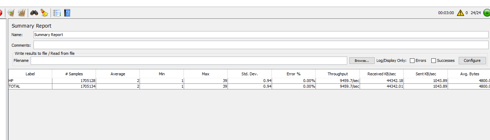
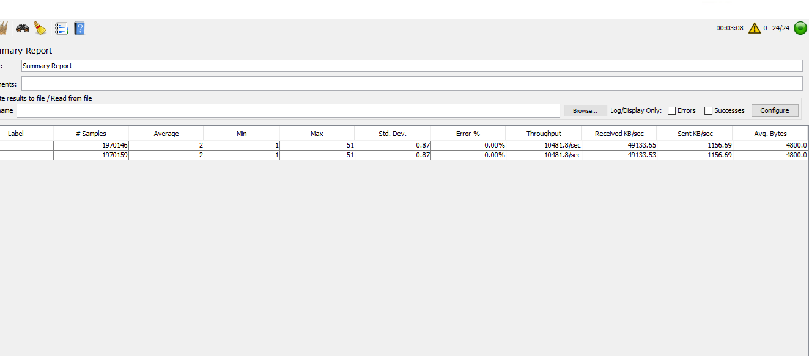

# Benchmarks

## 9-Apr
### SUT Specs
- Windows Server 2022 Datacenter Azure Edition 21H2
 - Intel(R) Xeon(R) Platinum 8370C CPU @ 2.80GHz   2.79 GHz
 - 128GB RAM

### Load Server Specs
- Windows Server 2022 Datacenter Azure Edition 21H2
 - Intel(R) Xeon(R) Platinum 8370C CPU @ 2.80GHz   2.79 GHz
 - 128GB RAM
 - JMeter Scenario:  24 Threads, 30s ramp-up, running for 3 minutes

 ### Results
- OTEL ON: 9459 req/s
- OTEL OFF: 10481 req/s

